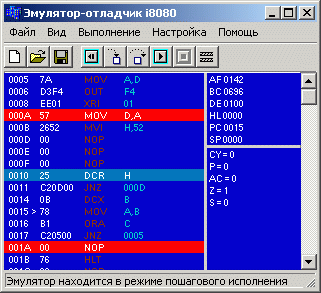

# Intel i8080 emulator for fun and education

Using simple i8080 CPU instruction students can aquire machine-language skills.

It's going to be fun because of simplicity and good examples.

This is the open projects- contributors are welcome.



It doesn't emulate any existed 8-bit computer in the past.
It's just pure i8080 CPU and some made-up peripherial devices.

Now porting to Qt framework (i8080emu v2.0) is in progress..

The current version is 1.3:
https://asashnov.github.io/i8080emu.html


## Эмулятор i8080

Это введение к действующей программе, написаной на Borland C++ 5.
Borland уже перестал быть лидирущей IDE для создания графических приложений,

Так что я принял решение переписать проект на Qt фреймворке. Помощники- добро пожаловать.

Эта программа была написана мной в рамках дипломного проектирования.
Она предназначена для использования в учебном процессе при изучении основ
микропроцессорной техники. С ее помощью студенты познакомятся с системой команд
микропроцессора i8080 (отечественный аналог К580) а также с принципами построения
микропроцессорных систем- программа эмулирует несколько внешних устройств,
подключенных к виртуальным портам ввода-вывода, а также позволяет добавлять новые
путем написания новых модулей расширения (не требуется перекомпиляция всей программы).

Прилагается шаблон для написания плагина (в архиве с исходными текстами).
Программа имеет удобный интерфейс, встроенный ассемблер i8080, справку по пользованию
программой и справочник команд. В окне ассемблера для быстрого вызова справки по команде
на которой стоит курсор работает сочетание клавиш Ctrl+F1.
Есть настройка цветовой схемы главного окна.


## Установка

Для установки эмулятора не требуется каких-либо особых действий.
Просто распакуйте архив i8080emu.zip сохраняя структуру каталогов.


## Плагины

С эмулятором поставляется несколько плагинов, имитирующих внешние устройства:

```
speaker.dll	PC-speaker plugin
	Output port: 0xf4, bit 0.
```


## Исходники эмулятора i8080

В настоящий момент разработка программы ведется на GitHub: https://github.com/i8080emu/i8080emu


## Links

https://eliben.org/js8080/  (https://github.com/eliben/js-8080-sim/)
https://www.asm80.com/
http://sensi.org/~svo/i8080/
Online i8080 assemblers/emulators

https://www.asm80.com/
Online (JavaScript) ZX Spectrum, CP/M, PMD85 (i8080 CPU) and other systems emulator.

https://github.com/omerjerk/i8080-emu
i8080 and Space Invaiders game

https://sourceforge.net/projects/i8086emu/
Advanced i8086 emulator with complex peripherial devices

http://fuse-emulator.sourceforge.net
The Free Unix Spectrum Emulator
MY COMMENT: that project was my inspiration for this project.

https://github.com/colinbourassa/crasm
CRASM is a portable cross-assembler for the 6800, ... and Z80.
MY COMMENT: this project also may be considered to use parts from.

https://www.onworks.net/software/app-tiny-i8080-emulator
https://sourceforge.net/projects/ncs8080/
Tiny i8080 emulator for Windows, Linux (Ubuntu, Fedora) and MacOS
written in C# with Space Inviders game.

https://sourceforge.net/projects/asm8080/
Intel 8080 Assembler
MY COMMENT: No releases yet, the code (with tests) developed in 2017-2018.
We will consider it instead of own.

https://github.com/mayawarrier/intel8080-emulator
An emulator for the Intel 8080 microprocessor, written in C89/ANSI C.
Supports asynchronous interrupts and emulates part of the CP/M 2.2 BIOS for 8080 binaries that target it.
MY COMMENT: The project was active in 2019, may be consider to use as a replacement for
my i8080 emu which is derived from fuseemu (Z80 emu) by stripping extra instructions)

https://sourceforge.net/projects/dlemu8080/
8080 emulator with Qt interface and VT terminal emulation. Capable of running CP/M.
Totally useless fun project. But feel free to enjoy it and help grow it.


https://www.tramm.li/i8080/index.html
Emu8080 is a complete CP/M system, it emulates an Intel 8080
microprocessor with VT100 terminal, four 8' floppy disk drives,
a paper tape reader, a paper tape puncher and line printer.

http://www.emulator101.com/
i8080 emulator for MacOS and iOS. Bonus: CHIP-8 and 6502 emulators.


Russian course of lections on K580:
https://www.youtube.com/playlist?list=PLZpTOzTNMmrOXliaWL_wLtDH2TpO8IVU9

Disscussion board (in Russian) on i8080:
https://www.cyberforum.ru/tags/i8080.html
